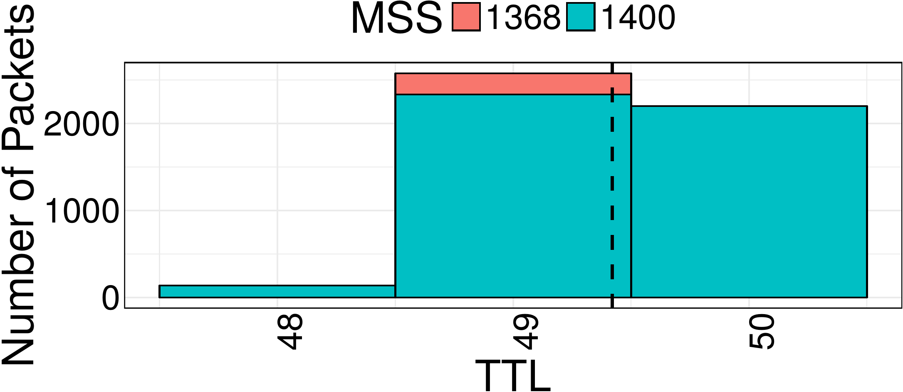
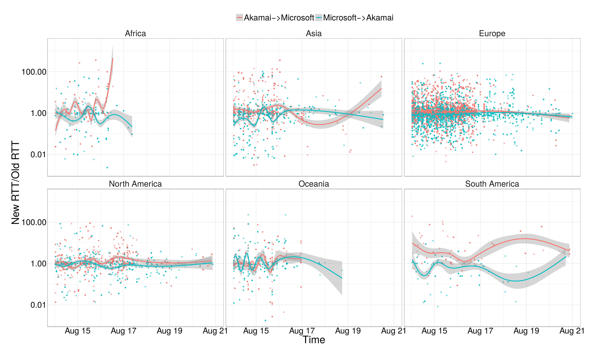

# R-Themes

A collection of R themes. The following packages are required:

 - ggplot2
 - ggthemes
 - RColorBrewer

They can be installed via:

`install.packages(c('ggplot2', 'ggthemes', 'RColorBrewer'))`

Or, to specify a repository:

`install.packages(c('ggplot2', 'ggthemes', 'RColorBrewer'), repos = c(CRAN = "http://cran.rstudio.com"))`

## Themes / Examples

`calipr`: The (un)official Calipr Lab ggplot2 theme.




## Usage

Include the selected theme file at the top of your R script, underneath the necessary includes specified above, with the `source` command, like so:

```
library(ggplot2)
library(ggthemes)
library(RColorBrewer)
source("calipr.r")
```

Then, apply the theme, which will be a function named by `theme_name()`, for example `theme_calipr()`, in the following format:

`theme_calipr(plot)`  

You can also apply theme colors through this function by passing in extra arguments:  

`theme_calipr(plot, fc="color", dtype="qual")`   

in which `fc` is the type of color, either "fill" or "color", and `dtype` is the data type, either "qual", "seq", or "div", standing for qualitative (categorical), sequential (gradient), and diverging (emphasizes values at extremes), respectively.
